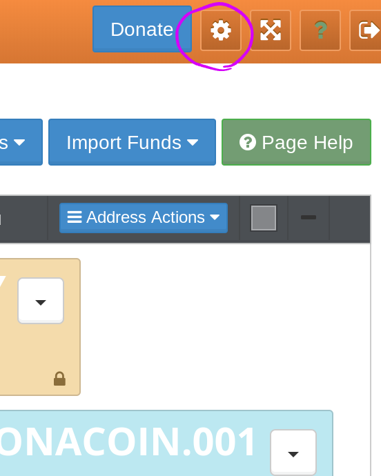
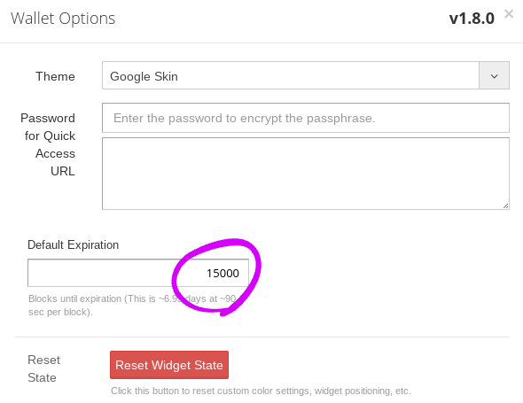

+++
title = "Extending Expiration"
date = 2019-07-13T01:00:00Z
draft = false
+++

Some messages like `order` has the value when it will be expired.
The default value is 15000 block. It will be 7days if blocks are added per 90 sec.

You can send your Monaparty message with the another expiration value if you are an enginner that can call Monaparty API.

And you can change it if you are not a software specialist.

## How to

### Counterwallet-mona

Open your wallet on your web browser and click the setting button.

Click `advance options` checkbox.

Set `default expiration` as you like.

Close the dialog.

note: all orders will be sent with the expiration block set above after do it.

### Other wallets

Ask the dev team of your wallet.

## Conclusion

Happy Monapartying!
