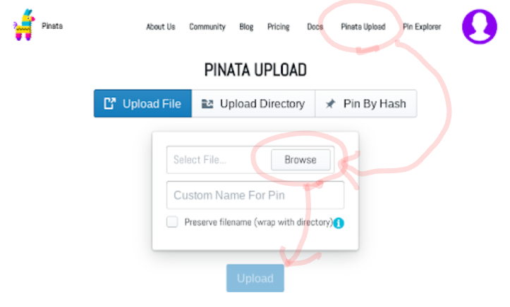

# Monaparty meets IPFS

From before, owners of Monaparty asset can provide extended information.
The information file is written in JSON format and located to HTTP(s) server.
The file can contain the link to the PNG image file. 

Since the next update, Monaparty federated node supports IPFS.
The new node accepts `ipfs://` style URLs. Some nodes will pin contents.
Contents will be available until the last one Monaparty node is removed.

In this article, I introduce how to apply the extended asset information via IPFS.

## Step by step

### Getting IPFS environment.

There are two ways to get IPFS interface.

The one is to run IPFS node on your environment.
This is a powerful way. But it requires more IT skills. I don't recommend this way in this article.

The another is to use a pinning service.
There are some IPFS based storage services on the Net.
Some of them provide a free-beer plan.

For example, We can use [Pinata](https://pinata.cloud/) in free charge until size of pinned content is over 1GB.
You can use it for free because your extended asset information requires less than 100KiB per asset.

I don't describe how to sign-up Pinata here.

If you don't like Pinata, there are some more services like Pinata. You can find the list on [IPFS official docs](https://docs.ipfs.io/concepts/persistence/#pinning-services). 


### Pinning PNG image

At the first you must have your image file.
The image must be 48x48, RGB or RGBA color pallete, PNG format.
(Yes, it is not Monacard. Monacard compatible card will be supported sooooon.)

#### Signup and login to Pinata

Ask Pinata for more details.

#### After logged-in to Pinata



1. You will find `Pinata Upload` link on the top of page. Please tap or click it.
2. You will find upload button. Please tap or click it.
3. The file selection dialog will be shown. Please choose your PNG image to link.
4. Upload button will be enabled. Please press it.
5. Upload will be finished soon. Please tap or click `Pin Explorer` on the top of page.
6. You will see the list of uploaded content. Please memo the string shown in `IPFS Hash`. the hash will be starting with `Qm`.

Finish. Your PNG image is pinned to Pinata.
All IPFS nodes can share your image until you unpin from Pinata.

### Creating JSON file

You must create JSON file for extended asset information.
The format is described in [Counterparty official](https://counterparty.io/docs/enhanced_asset_info/).

There are some notice.

* `asset` is required.
* The value of `asset` must be `name`. `longname` will be rejected.

For example, `MONABERET.SNOW` is longname. Its name is `A1172243916579404692`.

You can find the asset name of your subasset by using Mpchain like [this](https://mpchain.info/asset/MONABERET.SNOW).

The minimum example of JSON file is like this.

```
{
   "asset": "A4064929890528648700",
   "description": "Test asset.",
   "image": "ipfs://QmckBY5QYHA9Fi4DtRUzcRxbyFFNYXs2Qv4eQAmGebTFY3"
}
```

The value of `image` is `ipfs://` and IPFS hash that you got on Pinata avobe.

### Pinning JSON to Pinata

Please save your JSON file to your machine.
Then, please upload it to Pinata similar way to your PNG image.

You will get the hash of your JSON file via `Pin Explorer`.

### Make a request pin your content.

You can make a request pin your content to Monaparty node.
There is [a good tutorial on the Net](https://medium.com/@droplister/counterparty-tutorial-788c4e57c111#ab2e). See "Update Description".

The URL in `Description` should be `ipfs://{hash of JSON file}`

### Wait synchronization finished.

It will requires at least 60min to finish pinning your content on Monaparty nodes.
It may requires more than a day. But they will be pinned.

You can unpin your contents as Monaparty will pin yours.
But I recommend to keep your pin if possible.
I can't guarantee Monaparty network works always perfect.

# Note for dApp developers : IPFS-HTTPS gateway.

In case you want to use pinned contents in IPFS, you can access via HTTPS gateway.
To getting them replase each URLs `ipfs://{string}` to `https://mona.party/ipfs/{string}`

e.g. Both ipfs://QmckBY5QYHA9Fi4DtRUzcRxbyFFNYXs2Qv4eQAmGebTFY3 and 
https://mona.party/ipfs/QmckBY5QYHA9Fi4DtRUzcRxbyFFNYXs2Qv4eQAmGebTFY3 points same content.