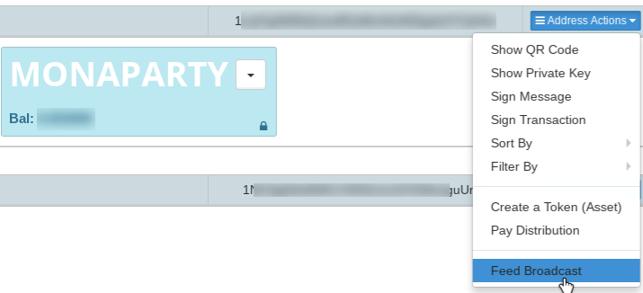
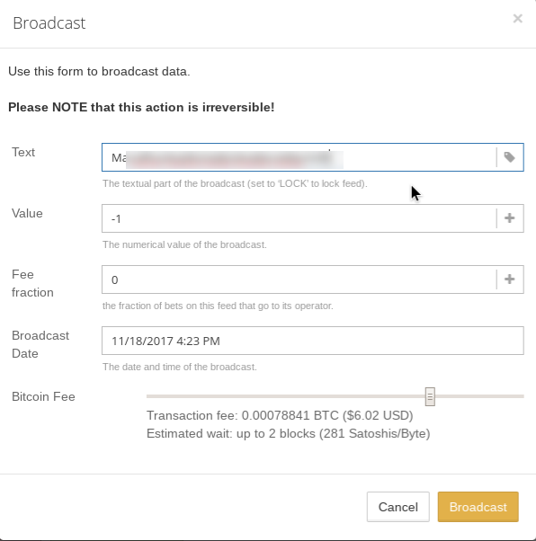
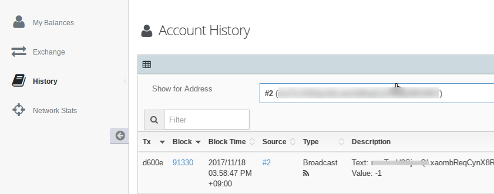

__注意: 本ページの記載内容は古いので [最新の情報](/how-to-token-swap)をご参照ください。__

# MONAPARTY から XMP へのトークンスワップ手順

下記の手順に従っていただくことにより、Counterparty 上の ICO トークンである MONAPARTY から、Monaparty の基軸トークンである XMP が配布されます。

## Counterwallet-mona でウォレットを開設する

https://wallet.monaparty.me/ へアクセスし、ウォレットを開設してください。

### ウォレットのアドレスをメモする

残高一覧にある Monacoin アドレスをメモしてください。最終的にこのアドレスに XMP が送金されます。

__注意: 必ず Counterwallet-mona のアドレスを記録してください。この手順を省いて Electrum-mona, Monappy, tipmona, AskMona, 仮想通貨取引所などで割り当てられている Monacoin アドレスを流用した場合には、配布される XMP が GOX する可能性があります__

### Counterwallet-mona のウインドウを閉じる

この作業は必須ではないですが、次作業以降は Monaparty ではなく Counterparty での作業となります。
混乱を防ぐために、Counterwallet-mona のウインドウは閉じることをお勧めします。
頭を切り替えるため、一服するのもお薦めです。

## Counterparty のアドレスと Monaparty のアドレスを紐付ける

### MONAPARTY トークンを保存してあるウォレットを開く

https://xcpwallet.monaparty.me/ または Counterparty 公式の Counterwallet を開き、MONAPARTY トークンを保存しているニーモニックを使ってログインしてください。

### Monacoin アドレスをブロードキャストする

MONAPARTY トークンを保持しているビットコインアドレスの項目の右端にあるプルダウンメニューを選択し「Feed Broadcast」を選択してください。

 
 
ダイアログボックスが表示されますので、Text の項目に上記でメモした Monacoin アドレスを入力してください。
その他の項目は特に変更する必要はありません。「Broardcast」ボタンを押してください。

この操作で MONAPARTY トークンの保持者が指定する XMP トークンの送信先が Counterparty のチェーン(つまり Bitcoin のブロックチェーン)に記録されます。このブロードキャストを起点として、トークンスワップの履行は、世界中の誰でも検証可能となります。

### ブロードキャストが完了したことを確認する。

ブロードキャストが完了したことは Counterwallet の History メニューを選択することで確認できます。

## MONAPARTY トークンを burn する

ブロードキャストの完了を確認できましたら、MONAPARTY を Bitcoin アドレス「1MonapartyMMMMMMMMMMMMMMMMMQ3QJNm」へ送金してください。
このアドレスへ送金された MONAPARTY トークンは誰も取り出せません。

## トークン配布を待つ

今回のトークンスワップは手動となりますので、少しお時間を頂くかもしれませんが、上記ブロードキャストで指定された Monacoin アドレスに XMP トークンが配布されます。
2週間待っても配布が確認できない場合にはお手数ですが admin@monaparty.me または Twitter @MonapartyXMP への mention 等でお知らせください。

## お困りでしたら

上記説明に解りづらい箇所がある、お手持ちのウォレットがブロードキャストに非対応である、等々お困りのことがありましたら、 Twitter @MonapartyXMP への mention でお知らせください。
