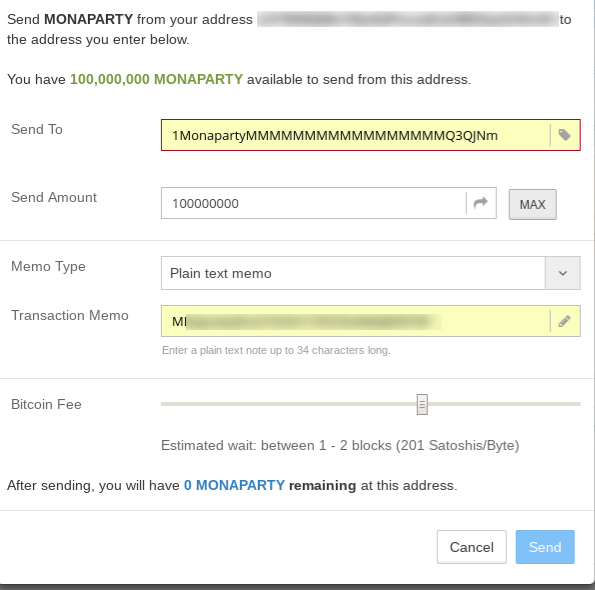

# MONAPARTY から XMP へのトークンスワップ手順

下記の手順に従っていただくことにより、Counterparty 上の ICO トークンである MONAPARTY から、Monaparty の基軸トークンである XMP が配布されます。

## Counterwallet-mona でウォレットを開設する

https://wallet.monaparty.me/ へアクセスし、ウォレットを開設してください。

### ウォレットのアドレスをメモする

残高一覧にある Monacoin アドレスをメモしてください。最終的にこのアドレスに XMP が送金されます。

__注意: 必ず Counterwallet-mona のアドレスを記録してください。この手順を省いて Electrum-mona, Monappy, tipmona, AskMona, 仮想通貨取引所などで割り当てられている Monacoin アドレスを流用した場合には、配布される XMP が GOX する可能性があります__

### Counterwallet-mona のウインドウを閉じる

この作業は必須ではないですが、次作業以降は Monaparty ではなく Counterparty での作業となります。
混乱を防ぐために、Counterwallet-mona のウインドウは閉じることをお勧めします。
頭を切り替えるため、一服するのもお薦めです。

## MONAPARTY トークンを burn する

__この burn は XMP を生成させる burn とは異なりますので、Monaparty の burn 開始以前に作業して頂いて構いません。__

ブロードキャストの完了を確認できましたら、MONAPARTY を Bitcoin アドレスへ送金します。

MONAPARTY 残高表示の脇にあるプルダウンメニューから「send」を選びダイアログを表示させます。

送金先 Bitcoin アドレスには「1MonapartyMMMMMMMMMMMMMMMMMQ3QJNm」を入力します。
送金額は別段の理由がなければ、MAX ボタンをおして全額を指定します。

次に Memo Type の横にあるドロップダウンリストで、「Plain Memo」を選択します。
「Transaction Memo」に、先ほど Counterwallet-mona でメモした Monacoin アドレスを入力します。

上記手順全て満たしたことを確認したら send で送信します。
ブロックに採り込まれるまで 10 分程度かかります。

## トークン配布を待つ

今回のトークンスワップは手動となりますので、少しお時間を頂くかもしれませんが、上記 burnで指定された Monacoin アドレスに XMP トークンが配布されます。
2週間待っても配布が確認できない場合にはお手数ですが admin@monaparty.me または Twitter @MonapartyXMP への mention 等でお知らせください。

## お困りでしたら

上記説明に解りづらい箇所がある、お手持ちのウォレットがメモ付き送信に非対応である、等々お困りのことがありましたら、 Twitter @MonapartyXMP への mention か
[AskMona のトピック](http://askmona.org/5105) でお知らせください。
